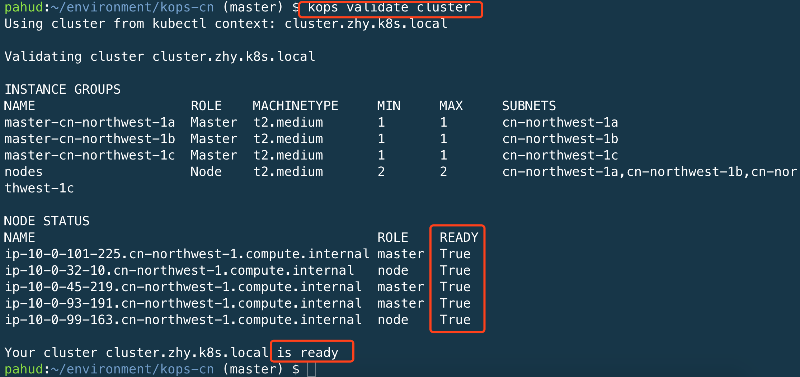

# kops-cn
This project is aimed to help you easily deploy the latest kops cluster in AWS China regions such as NingXia or Beijing region. You leverage the local docker images mirror or file repository assets mirror that help you accelerate the cluster creation without suffering the huge latency or connectivity issues from within China to other public sites like `gcr.io`.        
[中文README链接](README_ch.md)   

# Features
- [x] All docker images required for kops creation are mirrored in `Amazon ECR` **NingXia** or **Beijing** region.
- [x] All binary files or assets required for the cluster creation can be fetched directly from `Amazon S3` **Beijing** region.
- [x] Fast cluster creation and simple deployment
- [x] No VPN or secure tunnel required
- [x] Docker images required will be mirrored to Amazon ECR in `cn-north-1` by **CodeBuild**([buildspec.yml](https://github.com/nwcdlabs/kops-cn/blob/master/buildspec.yml)) triggered by Github push or pull request. See all required image [list](https://github.com/nwcdlabs/kops-cn/blob/master/mirror/required-images.txt).

# HOWTO

1. download this repository to local
```
$ curl  https://github.com/nwcdlabs/kops-cn/archive/master.zip -L -o kops-cn.zip
$ unzip kops-cn
$ cd kops-cn-master
```

2. follow the [installation guide](https://github.com/kubernetes/kops/blob/master/docs/install.md) to install the `kops` and `kubectl` binary on your laptop

You can also download `kops` and `kubectl` client binary from AWS S3 in China

```
//kops for linux
https://s3.cn-north-1.amazonaws.com.cn/kops-bjs/fileRepository/kops/1.10.0/linux/amd64/kops
//kops for mac os
https://s3.cn-north-1.amazonaws.com.cn/kops-bjs/fileRepository/kops/1.10.0/darwin/amd64/kops
//kubectl for linux
https://s3.cn-north-1.amazonaws.com.cn/kops-bjs/fileRepository/kubernetes-release/release/v1.10.6/bin/linux/amd64/kubectl
//kubectl for mac os
https://s3.cn-north-1.amazonaws.com.cn/kops-bjs/fileRepository/kubernetes-release/release/v1.10.6/bin/darwin/amd64/kubectl
```


3. edit `env.config`. You may need to change some of the variables as below


|        Name        |                    Description                     | values |
| :----------------: | :----------------------------------------------------------: | :------------------------: |
| **TARGET_REGION** | The region code to deploy the Kops cluster          |   **cn-north-1** or **cn-northwest-1**  |
| **KOPS_STATE_STORE** | Your private S3 bucket to save Kops state | s3://YOUR_S3_BUCKET_NANME |
| **vpcid** | The existing VPC ID to deploy the cluster | **vpc-xxxxxxxx** |
| **ssh_public_key** | SSH public key file path in the local | **~/.ssh/id_rsa.pub** [default] |

4. create the cluster
```
// if you need to specify different AWS_PROFILE
$ export AWS_PROFILE=bjs
$ source env.config
$ bash create-cluster.sh
```

5. edit the cluster
```
kops edit cluster $cluster_name
```
copy the content of `spec.yml` and insert into the editing window. Make sure the content is under `spec` then save and exit.


6. upate the cluster
```
kops update cluster $cluster_name --yes
```

7. DONE


# Validate

It may take 3-5 minutes before you can `kops validate cluster` to validate it as `ready`




And check the `cluster-info` as well as the kubernetes client/server version


Have Fun!

# Extra Installation after cluster creation
* Helm Installation in AWS China - https://github.com/nwcdlabs/kops-cn/blob/master/doc/Helm.md
* Istio Installation in AWS China - https://github.com/nwcdlabs/kops-cn/blob/master/doc/Istio.md


# FAQ

## can't validate the cluster?
See issue [#5](https://github.com/nwcdlabs/kops-cn/issues/5)

## how to SSH into the master node or worker node?
See issue [#6](https://github.com/nwcdlabs/kops-cn/issues/6)


## Some docker images missing and can't be pulled from ECR. What can I do?
As this project configures `containerRegistry` to ECR in `cn-north-1` which only hosts docker images defined in [required-images.txt](https://github.com/nwcdlabs/kops-cn/blob/master/mirror/required-images.txt), if you find any required images not available during the cluster creation, please directly edit [required-images.txt](https://github.com/nwcdlabs/kops-cn/blob/master/mirror/required-images.txt) from github web UI and this will fork a new branch from your github account so you can submit a PR(pull request) to me. By merging the PR, the `CodeBuild` behind the scene will be triggered and images defined in `required-images.txt` will be mirrored to ECR in `cn-north-1` within a few minutes and you should be able to see this badge icon status change - 

### check all FAQs [here](https://github.com/nwcdlabs/kops-cn/issues?utf8=%E2%9C%93&q=label%3AFAQ)
